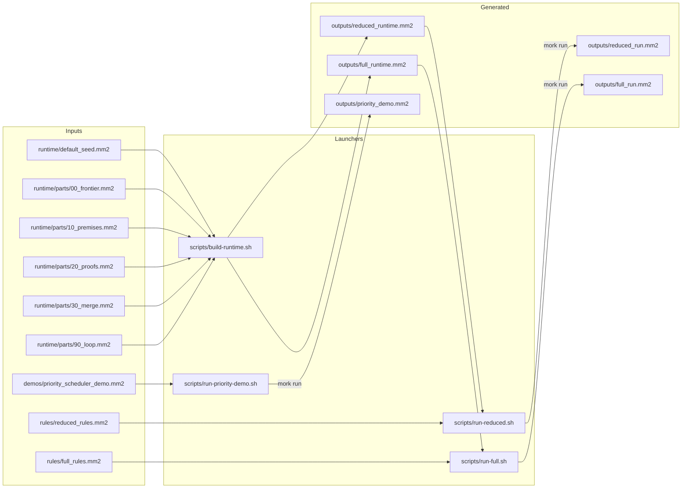
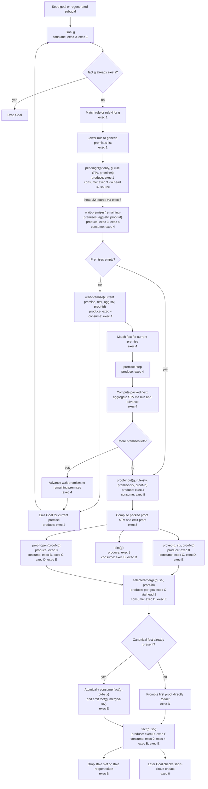

# Runtime Diagram

This document visualizes the current MM2 chainer runtime from two angles:

- how the runnable runtime is assembled by the shell entrypoints
- how a `Goal` moves through the generic `ruleN -> pendingN -> wait-premises -> proof -> merge` pipeline

## Assembly View

## Runtime Flow

## Reading Notes

- `head 32` is the rule scheduler gate from `pendingN` into `wait-premises`.
- Merge selection installs a small selector for each concrete goal; each selector uses `head 1`, so proofs for the same goal are serialized while distinct goals can merge independently.
- Single-premise `rule` entries are normalized into the same generic `ruleN` path as multi-premise rules.
- STVs are packed as `(strength confidence)` tuples throughout the runtime. Premise aggregation uses `min` across premise STVs, then proof STV uses rule STV `*` aggregated premise STV.
- Later proofs do not create duplicate canonical facts; they revise the existing `fact` through the merge path.
- `exec Z` is the control loop that keeps all `exec-template` rules live; it is runtime scaffolding, so it is not shown as a flow node above.

## Helper State Map

Some helper states are part of the runtime but were left out of the main flowchart to keep it readable:

- `proof-merged(...)`: produced by `exec D` or `exec E`, consumed by `exec B`
